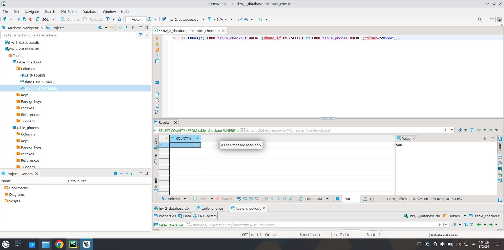
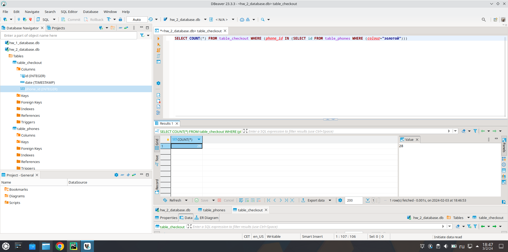
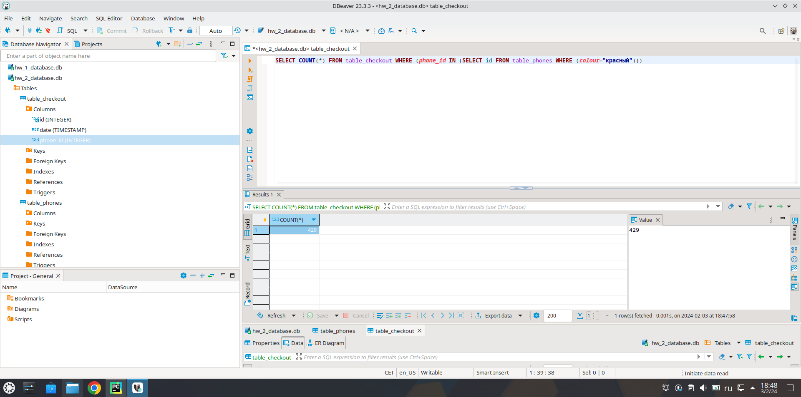

## Задача 2. Исследование продаж телефонов
### В PyCharm (Community Edition) в IDE БД не открывается, для открытия БД используется программа DBeaver. 
В таблице `table_phones` определяем какой цвет телефона соответсвует какому id.  
Синему цвету соответствуют id 1, 6, 8.  
Золотому цвету соответствует id 2.  
Красному цвету соответствуют id 3, 7, 9.  
Голубому цвету соответствуют id 4, 5. 

В таблице `table_checkout` ставим фильтр по `phone_id`.  
Для определения продаж телефонов синего цвета в запросе будет:   
`phone_id=1 OR phone_id=6 OR  phone_id=8`
  
Для определения продаж телефонов золотого цвета в запросе будет:   
`phone_id=2`  
   
Для определения продаж телефонов красного цвета в запросе будет:   
`phone_id=3 OR phone_id=7 OR phone_id=9`   
   
Для определения продаж телефонов голубого цвета в запросе будет:   
`phone_id=4 OR phone_id=5`   

1. Телефоны какого цвета чаще всего покупают?  
Чаще всего покупают телефоны синего цвета в количестве 500 шт.
2. Какие телефоны чаще покупают: красные или синие?  
Чаще покупают телефоны синего цвета. Телефоны красного цвета куплен в количестве 429 шт.
3. Какой самый непопулярный цвет телефона?  
Самый непопуляный цвет: золотой. Куплен в количестве 28 шт.

